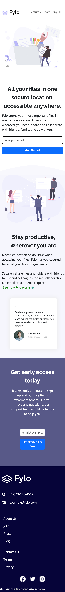
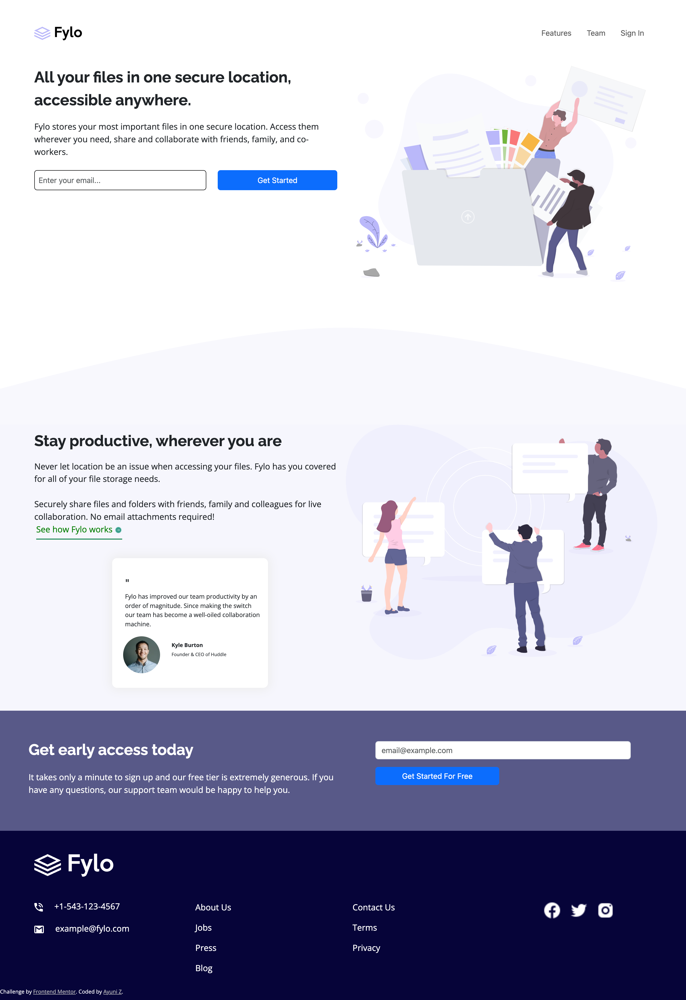

# Frontend Mentor - Fylo landing page with two column layout solution

This is a solution to the [Fylo landing page with two column layout challenge on Frontend Mentor](https://www.frontendmentor.io/challenges/fylo-landing-page-with-two-column-layout-5ca5ef041e82137ec91a50f5). Frontend Mentor challenges help you improve your coding skills by building realistic projects. 

## Table of contents

- [Overview](#overview)
  - [The challenge](#the-challenge)
  - [Screenshot](#screenshot)
  - [Links](#links)
- [My process](#my-process)
  - [Built with](#built-with)
  - [What I learned](#what-i-learned)
  - [Continued development](#continued-development)
  - [Useful resources](#useful-resources)
- [Author](#author)
- [Acknowledgments](#acknowledgments)

## Overview
This project contains many different rows (divs) to polish the skills of making responsive web designs. Each row contains 2 main column. Each column has its own set of challenges to make the items responsive in both mobile (375px) and desktop (1440px).

### The challenge
Users should be able to:

- View the optimal layout for the site depending on their device's screen sizes: mobile (375px) and desktop (1440px).

### Screenshot

### Links

- Solution URL: [Add solution URL here](https://github.com/fatimahayuni/fylo-landing-page-with-two-column-layout-master)

## My process

### Built with

- Semantic HTML5 markup
- CSS custom properties
- Bootstrap 5
- Mobile-first workflow

### What I learned

I learned how to use:
- Bootstrap 5
- Classes
- Divs
- Ordering
- Flexbox
- Writing nested divs
- Utilities

### Continued development

This project is done to the best of my ability within one week. I still have a few things to fix but overall, I am satisfied with my learning and progress. 

What I would like to focus on next:
- Change the form input placeholder font color to softer grey. 
- Make the logo in the desktop version bigger.
- Make the headers "Stay productive" and "Get early access today" smaller in mobile version. 

### Useful resources

- [Resource 1](https://www.getbootstrap.com) 
- [Resource 2](https://wwww.w3schools.com) - This website is still the best for an advanced beginner like myself.

## Author

- Github - [Fatimah Ayuni](https://www.github.com/fatimahayuni)
- Frontend Mentor - [@yourusername](https://www.frontendmentor.io/profile/ayunizaintech)

## Acknowledgments

Thanks to:
Arif, Malcolm, Anqi, JH, and Aditi for the help.
